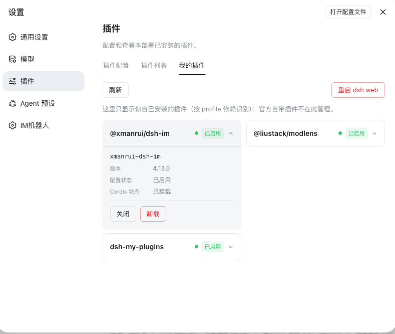
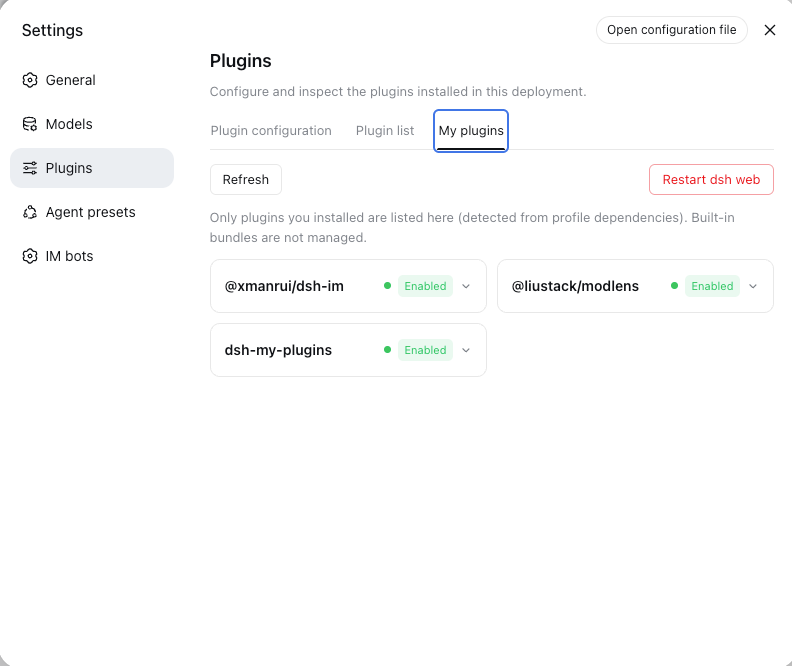

<div align="center">

# dsh-my-plugins

<p><strong>一个面板，只管理你安装的插件</strong></p>
<p><strong>One panel for the plugins you installed — nothing more</strong></p>

<p>
  <a href="LICENSE"></a>
  
  
  = 22">
</p>

</div>

---

## 简介

「我的插件」是挂在 **设置 → 插件** 区的一个 DSH 插件：查看、启用、关闭、卸载**你自己安装**的插件，官方自带的插件一律不显示、不管理。样式与官方插件清单完全一致（同一套主题变量），亮色/暗色模式自动跟随。

"My Plugins" is a DSH plugin tab inside **Settings → Plugins**: view, enable, disable and uninstall *only the plugins you installed*. Built-in plugins are never listed or touched. Styling matches the official plugin inventory exactly (same theme variables), and follows light/dark mode automatically.

<div align="center">
  <br>
  
  <p><em>「我的插件」面板 · My Plugins —— 设置 → 插件 → 我的插件（Settings → Plugins → My plugins）</em></p>
</div>

## 功能

| 操作 | 机制 | 生效时机 |
| --- | --- | --- |
| 查看 | profile `dependencies` ∩ Cordis Loader 条目，附版本与运行相位 | 实时 |
| 启用 | `loader.update(id, {disabled:false})` + 移除持久化停用行 | 热生效 |
| 关闭 | `loader.update(id, {disabled:true})` + 写入 profile 的 `cordis.patch.yml` 托管块 | 热生效，重启后保持 |
| 卸载 | `dsh plugin remove` + 清理 bundles 残留 + `loader.remove(id)` | 重启 dsh web 后完全生效 |
| 重启 | 面板内一键重启 dsh web（分离式 helper，端口释放后重新拉起） | 立即 |

卡片行为与官方插件清单一致：启用时显示状态点（绿＝已挂载 / 红＝挂载失败 / 蓝＝加载中）+「已启用」标签；停用时只显示「已停用」标签；同一时刻只展开一张卡片；顶部工具栏提供**刷新**与**重启 dsh web**。

### 判定「我的插件」的口径

profile（默认 `web`）的 `package.json` 中 `dependencies` 键 = 你安装的插件。官方自带包的条目永不纳入管理，面板不会给它们任何操作按钮。

### 持久化

停用状态写成 profile 的 `cordis.patch.yml` 中的托管块，重启后依然保持：

```yaml
# dsh-my-plugins managed begin
- id: <entryId>
  disabled: true
# dsh-my-plugins managed end
```

删除该块即可全部恢复启用。面板同时在 `$DSH_HOME/dsh-my-plugins/state.json` 保存镜像，启动时与实时 loader 树比对自愈（清理指向不存在条目或组条目的残留键）。

### 运行时 id 与补丁行 id

树内条目带组前缀（如 `include:dsh-pocket`）。Cordis Loader 原生支持 `a:b` 嵌套 id，因此运行时更新用**原始 id**；而写入补丁层的行必须用配置文件里的**纯 id**（最后一个 `:` 段）。两个形态、两个函数，互不混淆。

## 安装

从 GitHub 源安装（构建产物随仓库提交，无需本地构建）：

```sh
dsh plugin --profile web add https://github.com/I-am-shy/dsh-my-plugins.git
```

或从本地源码安装：

```sh
git clone git@github.com:I-am-shy/dsh-my-plugins.git
dsh plugin --profile web add file:/path/to/dsh-my-plugins
```

重启 `dsh web`、刷新浏览器，然后打开 **设置 → 插件 → 我的插件**。本 tab 使用 `order: 20`，排在「可配置」「插件列表」之后，固定在最后一位。

Need the tab in another language? Set the interface language in DSH settings — the panel switches between 中文 and English instantly (locale namespace `settings.myPlugins`).

## 使用

| 操作 | 做法 |
| --- | --- |
| 查看状态/版本/相位 | 点击卡片展开 |
| 关闭 / 启用 | 展开卡片 → **关闭 / 启用** |
| 卸载 | 展开卡片 → **卸载**，弹窗确认 |
| 重启 dsh web（完成卸载、干净生效） | 工具栏 → **重启 dsh web** |

重启后页面会轮询服务器恢复并自动刷新当前页（要求连续 3 次探测成功再刷新，避免撞上未完成启动的服务器）。

## HTTP API（同源、仅回环）

| 端点 | 方法 | 请求体 | 作用 |
| --- | --- | --- | --- |
| `/my-plugins/list` | GET | — | 插件列表 + profile + 端口 |
| `/my-plugins/set-enabled` | POST | `{pkg, enabled}` | 启停 + 持久化 |
| `/my-plugins/uninstall` | POST | `{pkg}` | 卸载 + 清理 |
| `/my-plugins/restart` | POST | `{}` | 重新拉起 dsh web |

## 设计

- 只在官方「设置 → 插件」注册一个「我的插件」tab（`order: 20`），不新增一级菜单入口；
- 只管理 `dependencies ∩ loader 条目`，官方自带（`@deepseek-ai/dsh-base` / `dsh-web-app` 展开的条目）永不纳入；
- 组条目（`options.group`）永不作为操作目标，面板拒绝关闭自身（防止持久化后无法从界面恢复）；
- 所有操作写入审计日志 `$DSH_HOME/dsh-my-plugins/audit.jsonl`；HTTP 只接受 loopback + 同源 Origin 请求；
- 浏览器只拿到脱敏列表（无任何凭据/密钥回传）；重启 helper 以注入 `--no-open` 的方式重新拉起，不弹新浏览器窗口。

## 本地开发

```sh
npm install
npm run typecheck    # tsc --noEmit 严格检查
npm run build        # 构建 src/host → lib/index.js、src/client → client/client.js
npm run build:watch  # 变更即重建
```

`lib/` 与 `client/` 产物随仓库提交，消费者安装时零构建。本地与活着的 dsh web 联调时推荐符号链接开发环（避免 file: 安装硬链接被编辑工具换 inode 后残留旧副本）：

```sh
# 首次注册后，把 pnpm 硬链接副本替换为符号链接
rm -rf ~/.dsh/profiles/web/node_modules/dsh-my-plugins
ln -s /path/to/dsh-my-plugins ~/.dsh/profiles/web/node_modules/dsh-my-plugins
```

改完 client 刷新页面即可（模块系统按需加载）；改 host 需重启 dsh web。

## 项目结构

```
dsh-my-plugins/
├── src/
│   ├── host/                  # Node 侧（构建 → lib/index.js，ESM）
│   │   ├── index.ts           #   入口：inject + apply + 启动自愈
│   │   ├── constants.ts       #   路径、块标记、fiber 相位映射
│   │   ├── types.ts           #   服务/状态/行类型
│   │   ├── audit.ts           #   审计日志
│   │   ├── profile.ts         #   profile package.json 读取
│   │   ├── patch.ts           #   cordis.patch.yml 渲染 + 状态读写
│   │   ├── loader.ts          #   条目发现（组安全）
│   │   ├── operations.ts      #   启用/关闭/卸载
│   │   ├── restart.ts         #   分离式重启 helper
│   │   └── routes.ts          #   /my-plugins HTTP API
│   └── client/                # Web 侧（构建 → client/client.js，CJS 单文件）
│       ├── index.ts           #   __ModuleLoader__ 注册
│       ├── app.ts             #   slots + 语言 + 样式接线
│       ├── component.ts       #   面板组件
│       ├── api.ts             #   同源 RPC
│       ├── locales.ts         #   中英词典
│       └── styles.ts          #   主题变量 CSS
├── lib/index.js               # 构建产物（已提交）
├── client/client.js           # 构建产物（已提交）
├── scripts/build.mjs          # esbuild 管线（含 --watch）
├── tsconfig.json              # 严格 TS / noEmit
├── cordis.patch.yml           # 条目插入清单
└── package.json               # dsh 清单 + npm 元数据
```

## 已知边界

- 卸载是结构性操作（pnpm 包已移除），重启 dsh web 后完全生效——面板如实提示并与你一起完成重启；
- `loader.update` 属于条目级热重启；带常驻服务的插件在关键操作后重启一次 dsh web 最干净；
- 仅 profile `dependencies` 内的包可管理；官方自带插件不在管理范围（有意为之）。

## 排查

### 改动后面板没变

profile 内的安装产物可能是旧硬链接副本（编辑工具换 inode 写文件时断裂）。重新 `npm run build`，然后重装或按上文切换为符号链接。

### 重启后已关闭的插件又启用了

持久化块在 profile 的 `cordis.patch.yml`（`~/.dsh/profiles/web/cordis.patch.yml`）。文件被重建或块被删除会重置状态——这是特性：删掉托管块即全部恢复。

---

## 贡献

欢迎 Issue 与 PR。请保持 `npm run typecheck` 干净，并使构建产物与源码同步提交（`npm run build` 后一并 commit）。

## 许可证

[MIT](LICENSE) © 2026 I-am-shy